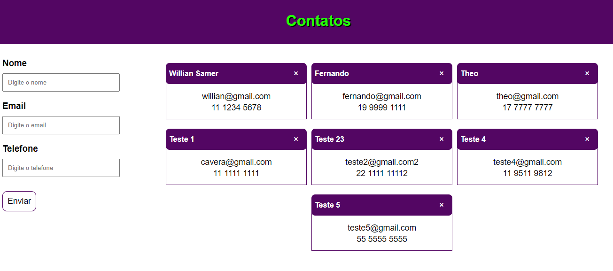

# CRIANDO UM SISTEMA DE CONTATOS EM GRAPHQL

Criado um sistema de contatos utilizando GraphQL. 
Com um banco de dados relacional(Postgres), o sistema deve ser capaz de cadastrar, listar, atualizar e excluir contatos.

## Integração BACK/FRONT: GraphQL

## BACKEND

> Frameworks: 
>> NodeJs
>> GraphQL
>> Apollo-Server

## FRONTEND

> Frameworks: 
>> ReactJs
>> GraphQL
>> Apollo-Client

> Framework CSS: CSS3

## Banco de Dados:

> Banco de Dados(DBeaver): Postgres

> Migrations: Knex

> Instândia: Docker

## Documentações

> https://www.apollographql.com/docs/
> https://graphql.org/learn/